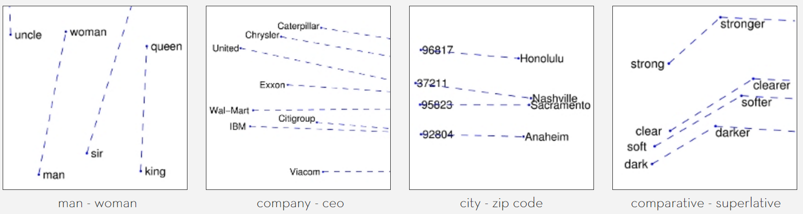
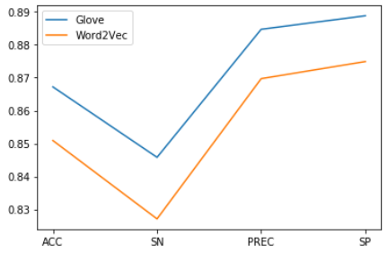
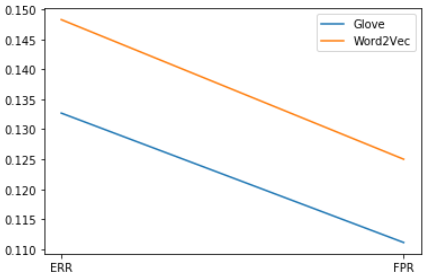

# ev-sentiment_analysis
##### 충남대학교 제1회 2019 bottom-up 경진대회 EV팀  

##### 목표 : 감성분석 시각화 

##### 머신러닝을 활용한 NLP의 활용 (sentiment analysis) 

공개된 데이터셋(Naver sentiment movie corpus) : <https://github.com/e9t/nsmc/>
20만 문장 (train 15만 + test 5만)

오픈 소스코드를 활용하여
직접 수집한 데이터셋 (naver_movie_scraper폴더 참조) : <https://github.com/lovit/naver_movie_scraper>
27만문장

**학습 및 평가에 사용된 총 데이터셋 47만문장 (train 40만 + text 7.5만)**

두가지 버전으로 제작하였습니다.

Master - 문장들을 Word2Vec 임베딩하고 입력데이터의 특징벡터를 추출하여 다층 신경망을 통해 Binary logistic regression 모델

Pytorch_ver - 문장들을 Glove 임베딩하여 LSTM + Attention 를 사용하여 학습시킨 RNN 모델

두 방법의 임베딩 방법 차이

1.Word2Vec

from : https://becominghuman.ai/how-does-word2vecs-skip-gram-work-f92e0525def4

**Word2Vec**은 중심단어와 주변단어 벡터의 내적이 코사인 유사도가 되도록 단어벡터를 벡터공간에 임베딩. 
중심단어에 해당하는 벡터와 주변단어에 해당하는 벡터의 내적값을 높이는 방식으로 임베딩을 한다. 벡터 내적은 코사인이므로 내적값 상향은 단어벡터 간 유사도를 높인다 

2.Glove

from : https://nlp.stanford.edu/projects/glove/

**GloVe**은 임베딩된 두 단어벡터의 내적이 말뭉치 전체에서의 동시 등장확률 로그값이 되도록 목적함수를 정의 
임베딩된 단어벡터 간 유사도 측정을 수월하게 하면서도 말뭉치 전체의 통계 정보를 좀 더 잘 반영하도록 한다. 
임베딩 된 중심 단어와 주변 단어 벡터의 내적이 전체 코퍼스에서의 동시 등장 확률이 되도록 만드는 방법. 

두 방법의 성능 차이

75000개의 test set에 대해서...

​												Glove_ACC = 0.8672      Word2Vec_ACC = 0.8509 
​												Glove_SN = 0.8458       Word2Vec_SN = 0.8271 
​												Glove_PREC = 0.8847     Word2Vec_PREC = 0.8697 
​												Glove_SP = 0.8888       Word2Vec_SP = 0.8749 

​												Glove_ERR = 0.1327     Word2Vec_ERR = 0.1483 
​												Glove_FPR = 0.1111     Word2Vec_FPR = 0.1250 
